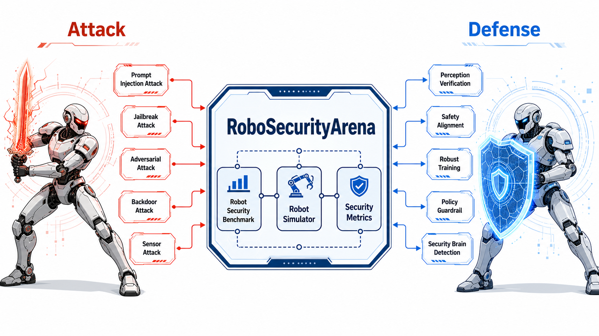

# Overview

具身智能安全攻防竞技场是一个面向具身智能的安全评测与攻防演练平台。它的目标不是单纯展示模型能力，而是在可控、可复现、可量化的环境中，系统性评估具身智能体在感知、规划、执行、协作和人机交互过程中的安全风险，并为研究人员、开发者和安全团队提供统一的测试基准与演练流程。

随着具身智能的发展，其不仅需要理解指令，还需要观察环境、调用工具、操作设备、与人协作，并在动态场景中做出连续决策。这种能力扩展也带来了新的安全问题：错误感知可能导致危险动作，恶意指令可能诱导越权行为，环境干扰可能破坏任务执行，工具调用链可能被注入或劫持。

本竞技场围绕这些问题构建标准化的攻防任务，让使用者能够在仿真或受控实验环境中设计攻击、构建防御、复现实验并比较结果。平台强调安全边界、透明规则和研究可复现性，所有攻防任务都应服务于风险发现、防护验证和系统改进。

## 建设目标

- 建立面向具身智能系统的安全评测基准，覆盖感知、推理、规划和控制等关键环节。
- 提供可复现的攻防场景，使不同模型、策略和防御机制能够在统一条件下进行比较。
- 支持红队测试与蓝队防护演练，帮助发现系统在真实部署前的潜在风险。
- 形成面向科研、教学和工程落地的文档体系，沉淀任务定义、评测指标、实验流程和安全规范。
- 推动具身智能安全从单点漏洞分析走向系统级、场景级和任务级评估。

## 竞技场组成

竞技场由以下几个部分构成：

- **任务场景**：包括导航和抓取等具身智能典型任务。
- **具身智能体接口**：定义具身智能体的输入输出。
- **攻击模块**：用于构造提示注入、视觉干扰、环境扰动、目标误导等攻击模块。
- **防御模块**：用于实现输入过滤、策略约束、权限控制、异常检测和行为审计等防御模块。
- **评测系统**：记录任务成功率、安全违规率、鲁棒性、恢复能力、资源消耗和防御开销等指标。
- **日志与复现工具**：保存轨迹、指令、传感器观测、模型响应、动作序列和关键事件，支持实验复盘。

## 攻击方法覆盖

- **提示注入攻击**：通过恶意指令、上下文污染或任务改写，诱导智能体偏离原始目标。
- **越狱攻击**：绕过安全约束、权限边界或系统规则，触发本不应执行的操作。
- **对抗攻击**：利用视觉、语言视觉或环境中的扰动样本，干扰感知与决策。
- **后门攻击**：在模型、技能或触发条件中植入隐蔽行为，平时正常、触发后异常。
- **传感器攻击**：通过遮挡、贴纸、光照变化、伪标识或物理扰动影响传感输入。

## 防御方法覆盖

- **输入过滤**：对输入指令、环境文本和工具返回进行安全检查与清洗。
- **安全对齐**：让模型在训练或对齐阶段学会拒绝危险行为并遵守安全原则。
- **鲁棒训练**：通过增强、对抗训练或经验回放提升模型在扰动下的稳定性。
- **策略约束**：把安全规则、权限边界和可执行约束显式纳入规划与动作选择。
- **安全检测**：在运行时识别异常轨迹、危险信号、技能投毒或策略偏移。

## 评测维度

竞技场的评测不只关注任务是否完成，还应关注完成过程是否安全、可信和可解释。本项目使用以下指标：

- **任务完成率**：具身智能体是否完成预定目标，完成质量如何。
- **安全合规性**：执行过程中是否触发危险动作、越权访问或违规操作。
- **攻击成功率**：攻击是否改变了具身智能体行为，是否造成目标偏移或安全失效。
- **防御有效性**：防御机制是否能识别、阻断或缓解攻击。
- **鲁棒性**：面对扰动、噪声和不确定环境时，系统表现是否稳定。

## 安全准则

本项目面向安全研究、系统评测、教学演示和防御能力建设。所有攻击设计都应在授权、隔离和可控环境中进行，不应被用于破坏真实系统、绕过实际安全机制或造成物理世界风险。